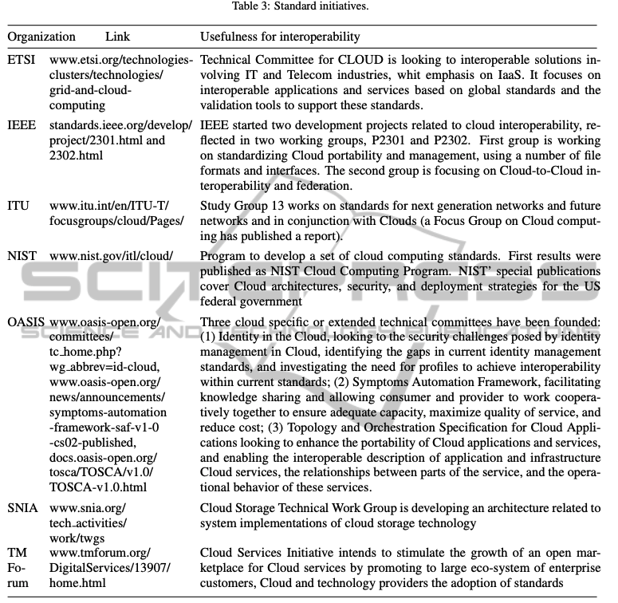
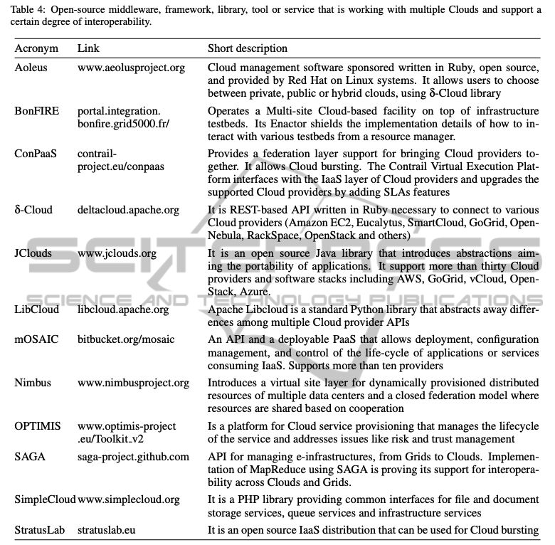

# Multi-cloud

## Table of Contents
- [Use Cases of Multiple Clouds](#use-cases-of-multiple-clouds)
- [Interoperability](#interoperability)
- [Types and Targets of Cloud Interoperability](#types-and-targets-of-cloud-interoperability)
	- [Agreement level](#agreement-level)
	- [Adoption level](#adoption-level)
	- [Deployment level](#deployment-level)
	- [Patterns of interactions between clouds](#patterns-of-interactions-between-clouds)
	- [Targeted levels for cloud interoperability](#targeted-levels-for-cloud-interoperability)
- [On the Interoperability in Multiple Clouds](#on-the-interoperability-in-multiple-clouds)
	- [Interoperability Requirements](#interoperability-requirements)
	- [Example](#example)
- [Cloud Portability](#cloud-portability)
- [Types of Cloud Portabiity](#types-of-cloud-portabiity)
- [Requirements of portability at different deployment levels](#requirements-of-portability-at-different-deployment-levels)
- [Main Requirements for Cloud Interoperability and Portability](#main-requirements-for-cloud-interoperability-and-portability)
- [Approaches to Cloud Interoperability and Portability](#approaches-to-cloud-interoperability-and-portability)
- [The above APIs for multiple clouds can be classified as follows:](#the-above-apis-for-multiple-clouds-can-be-classified-as-follows)
	- [The two widely adopted standards are:](#the-two-widely-adopted-standards-are)
	- [Technical requirements versus standards:](#technical-requirements-versus-standards)
	- [Different layers of abstractions are used for example in the case of:](#different-layers-of-abstractions-are-used-for-example-in-the-case-of)
- [References](#references)

---

When talking about multi-cloud environments:

- **Interoperability** means the ability of two distinct cloud environments to talk to each other - to exchange information in a way that both can understand.
- **Cloud portability** is the ability to move applications and data from one cloud environment to another with minimal disruption.

## Use Cases of Multiple Clouds

Use cases of multiple clouds have been reported in numerous papers in the last half decade. In a try to classify them, we can follow the NIST proposal concerning the deployment scenarios in multiple clouds:

**Serially, one cloud at a time**, with three scenarios:  
_(a) migration between clouds;_  
_(b) interface across multiple clouds;_  
_(c) work with a selected cloud;_

**Simultaneously, several clouds at a time**, when _operate across multiple clouds_.

## Interoperability

> At its core, interoperability **requires shared processes, APIs, containers and data model**s across the multi-cloud environment to enable communication between application components.

### Types and Targets of Cloud Interoperability

Several criteria for classification of interoperability types can be identified:

#### Agreement level

– **_syntactic_**, when the systems are **capable of communicating and exchanging data** (using specified data formats, communication protocols).

– **_semantic_**, as **automatically interpretation of the information exchanged**, meaningfully and accurately, in order to produce useful results (using a common information exchange reference model);

#### Adoption level

– **_by design_** when vendors or individuals **use a standard documentation** to make products (no specific liability or advantage for any customer for choosing one product over another);

– **_post-facto_**, result of **absolute market dominance** of a particular product;

#### Deployment level

– **_horizontal_** **interoperability of the services at the same deployment level** (likely within IaaS, harder to the customized PaaS and SaaS);

– **_vertical_** interoperability (vertical supply chain) when **cloud services can be build on top of other cloud services** from other deployment level;

#### Patterns of interactions between clouds

– **_Synchronous_**: **direct calls**, suitable only for very specific real-time applications where the response time is critical;

– **_Asynchronous_**: applications are **loosely coupled** so that consuming application do not wait for a response (best option in cloud).

#### Targeted levels for cloud interoperability

– **Business level**, **achieved between different business strategies** that are imposed on the services, regulations on the services, and mode of use.;

– **Semantic level**, with **focus on functions calls and responses for consumers requests** as well as message contents;

– **Application/service level** when **automated, generalized and extensible solutions are provided to use new resources** (other than re-compiling, there are no fur- ther changes required of the application). Components could be **reconfigured** while running, or with limited interruption, **to respond to changes** in usage patterns or resource availability. Application **configuration must be resilient to changes** in the configuration within each cloud – for example scaling or migration of computational resources. From simple execution-unaware applications using multiple environments, to applications with multiple distributed components, the complexity is non-uniform and depends upon the application. A pre-requisite is infrastructure independent programming;

– **Management** when a **management application coordinate and control components in multiple clouds**. Standardized functionality for deployment and migration of VMs is required. Interactions between actors responsible for application management and infrastructure management is needed;

– **Technology/infrastructure level**, achieved by **agreeing on or accepting particular encoding scheme** for requests and response, selection of communication protocol or middleware, language, and the platform for working environment;

– **Image/data** looks at VM images, applications, or databases, and how they can be **deployed on another host without modification** (as pre-deployed, ready to run applications packaged as VMs, namely ”work loads”).

– **Network** seek support to **uniform access to individual resources and concatenation/federation** (standards for allocation and admission control are needed).

### On the Interoperability in Multiple Clouds

**Figure 1** is suggesting the three dimensions of the interoperability problem. Two are technical and encountered as pointed earlier, at run-time in Federated Clouds and at design time in Multi-Cloud. The third dimension is non-technical, more human oriented, as being related to policy, i.e. establishing agreements and contracts between providers, as well as standards elaborations and promotion.

#### Interoperability Requirements

For the run-time dimension, at the infrastructure levels (last two in the table and image), several partial solutions exists to migrate virtual machines, virtual storage or services. Despite the presence of standard OVF format, the VMs are not yet ready for interoperability. For example, Amazon is one of the few Cloud providers who are allowing to export VMs; however, their related resources (e.g. network, storage) cannot be exported too. In general, VMs cannot be transferred from one hypervisor to another. VMs can be converted today with tools like qemu-image, but this requires to stop the VM and to apply the adaptation off-line.

It should be also mentioned that the diversity of the APIs is natural, as each providers intends to offer something new or unique compared with other offers, in order to attract customers. The interoperability issue is therefore an issue for the management and governance levels where automation should be achieved as much as possible. The mix-in of services from different providers can be a strong argument in using such entry level instead a direct connection to only one provider. Therefore the management and service automation levels in multiple Clouds are the hot-spots of the development activities in the last two years (commercial solutions like RightScale, enStratus or Kaavo have emerge that are able to deploy applications in various Clouds, but not yet migrate the running ones).

For the design time dimension, several prototypes are available, from frameworks like SLA@SOI or the more recent (Di Modica et al, 2012), as well as APIs like jclouds, libcloud or OpenStack (a more complete list at (Lee, 2009)), or emerging standards like CloudML, but there is no wide acceptance of one or another proposal. Nor a Cloud specific programming model has emerge, despite the high-potential of the concept of e-infrastructure programming (Petcu et al, 2012b).

**Figure 2** is proposing a split of the requirements in different categories (based on the initial classification proposed in (Khattak et al, 2010). The top level is associated with the policy dimension; the next one with the design; the last three with the run-time. The most complex level is the one related to application and services, that is covering both design and run-time.

While industry bodies are developing common cloud standards, Cloud Service Providers (CSPs) are developing adapters, APIs and containers to facilitate interoperability across platforms.

**Tables 2 and 3** are pointing to some of the standards respectively standard initiatives that are relevant for interoperability.

#### Example

**mOSAIC** is providing an open-source and deployable Platform-as-a-Service that is supporting multi-Cloud scenario of re-deployment. The initial cycle of its development was supported through a collaborative and multi-national project, funded by the European Commission and ended in Spring 2013.

**Table 4** indicates the main components of the latest stack of mOSAIC’s software:

Drivers and vendor agents are currently available for various Public Cloud providers _(Amazon, Flexiant, CloudSigma, GoGrid, OnApp, NIIFI)_ as well as for Private Cloud support technologies _(Eucalyptus, OpenNebula, VMware, DeltaCloud, OpenStack, CloudStack)_.

– **Red components:** for the design phase: API libraries (for Java, Python and Erlang) with examples; application tools including plug-ins for Eclipse, templates and workflows; semantic support for developing applications, using domain specific and Cloud ontologies; a service-level agreement framework based on concepts introduced by SLA@SOI;

– **Green components:** for the deployment phase: the brokerage system including the Cloud Agency that assists in the selection of the Cloud provider according to the application needs specified in a particular descriptor and generating the service level agreement, as well as vendor agents;

– **Blue components:** for the runtime phase: support for a Personal Cloud (on a desktop using the Portable Testbed Cluster), for provider resource allocation based on existing credentials, the minimal kernel of the platform (mOS) to run remotely on providers’ virtual machines, a naming service that offers an application virtual domain, and the execution engine that allows the control of the deployed applications; customized versions of open source Cloud technologies (for message queues, key value stores, distributed file systems) are available to be deployed (COTS) with corresponding drivers; special web-interfaces and console interfaces are allowing the control of the application life-cycle at the level of their components; benchmark sets are supporting the testing of applications and infrastructure services;

– **Purple components:** the proof-of-the-concept applications.

Secure multi-cloud network architectures take into account:

- **The cloud edge**, which connects the enterprise WAN to the cloud across regions and between multiple public clouds. This may consist of various transit gateways and native cloud interconnects.

- **The WAN edge**, which connects on-prem workloads and end users to external networks through private WAN and/or internet. SD-WAN devices deployed near a branch office or remote working hub are examples of the WAN edge.

- **Transport connectivity** (MPLS, internet, LTE, 4G, 5G) linking the WAN edge and cloud edge become part of SD-WAN fabric enabling improved application performance and cost-efficiency.

- **Software-defined network and security services** such as FWaaS, ZTNA, CASB, and others.

## Cloud Portability

> **Cloud portability** is the **ability to move an application or data from one cloud service provider to another without the need to rewrite or restructure them**. For cloud data portability, the information can be moved to another service provider without reentering it.

### Types of Cloud Portabiity

– **_Functional portability_**: ability to **define application functionality QoS details in a platform-agnostic manner**. OVF provides a basis for portability but does not address complex configuration or interactions with any supporting systems. Domain specific languages are expected to bridge the gap between executable artifacts and high-level semantic models.

– **_Data portability_:** ability for a customer to **retrieve application data from one provider and import this into an equivalent application hosted by another provider**. Achieving data portability depends on standardization of data im- port and export functionality between providers. It is necessary to provide a platform-independent data representation, and generate the specific target representations and even the code for the application’s data access layer;

– **_Services enhancement_:** **use metadata added through annotations**. Control APIs allow infrastructure to be added, reconfigured, or removed in real time, either by humans or programmatically based on traffic, outages or other factors.

### Requirements of portability at different deployment levels

– **SaaS:** the cloud customer is substituting software applications with new ones. The focus is on preserving or enhancing the functionality provided by the application. **Portability is evaluated based on open source code base, proprietary or open standard data formats, integration technologies and application server/operating system.**

– **PaaS:** some degree of application modification will be necessary to achieve portability. The focus is on **minimizing the amount of application rewriting while preserving or enhancing controls, and a successful data migration**. Portability is evaluated based on proprietary or open source programming languages for application development, proprietary or open data formats, tight integration or loose coupled services, abstraction layers for queuing and messaging services.

– **IaaS:** the applications and the data migrate and run at a new cloud provider. **Portability is evaluate based on ability to port VMs and the underlying configurations across infrastructure providers.**

## Main Requirements for Cloud Interoperability and Portability

– **_Programming:_** move from one provider to another without dramatic reimplementation; **common set of interfaces; standard API** enabling an entity to build something once, then use it to **monitor and control a variety of platforms**; work with both cloud-based and enterprise-based applications using a single tool set that can **function across existing programs and multiple cloud providers**; new programming models; ontology of cloud; high level modelling.

– **_Application:_** able to **span multiple cloud services**; **data exchange**; **data portability**; private cloud applications obtain resources from public cloud when excess capacity is needed; location-free applications; workflow management;

– **_Monitoring:_** SLA and performance monitoring; SLAs in support of governance requirements; deliver on demand, reliable, cost-effective, and QoS aware services based on virtualization technologies while ensuring high QoS standards and minimizing service costs; QoS and SLA items to be guaranteed end-to- end; monitoring and management of load balanced applications in an elastic environment; scalable monitoring of system components; service monitoring and audit; publish sets of benchmarks to evaluate performance factors;

– **_Deployment:_** provision resources from multiple cloud services with a single management tool; agreements between providers; service discovery; common platforms to ensure users can navigate between services/applications; enabling a service hosted on one platform to automatically call a service hosted by another; automatically provision services and manage VM instances; virtual organization management; resource discovery and reservation procedure; service setup procedure; interworking between clouds and the network – routing optimization based on monitoring; automatism and scalability – home cloud using discovery mechanisms able to pick out the right foreign clouds; support for multiple hypervisor technologies; application service behavior prediction;

– **_Authentication, authorization, security:_** single sign-on for users accessing multiple-cloud; integration of different security technologies (home cloud able to join federation without changing security policies); digital identities; identity federation and management across vendors; standards for security specification, platform components and configuration; authentication procedure when use different domains; cloud trust mechanisms; auditing, security mechanisms for authentication and authorization;

– **_Market:_** economic models driven optimization techniques; market driven resource leasing federation – application service providers host their services based on negotiated SLAs driven by competitive market prices; flexible mapping of services to resources to maximize efficiency, cost-effectiveness, and utilization; accounting; license flexibility.

## Approaches to Cloud Interoperability and Portability

The approaches to interoperability and portability can be classified in building and using:  
**(1)** open APIs  
**(2)** open protocols  
**(3)** standards  
**(4)** layers of abstractions  
**(5)** semantic repositories  
**(6)** domain specific languages  

Open APIs are for example jClouds (Java), libcloud (Python), Cloud::Infra- structure (Perl), Simple Cloud (PHP), Dasein Cloud (Java), proprietary APIs being for example Micosoft Azure (.NET) or Fujitsu API.  
– [**_JCloud_** ](https://jclouds.apache.org/)provides a framework for interacting with blob storage, queue storage, and compute resources for a variety of clouds (requires service and location information to access a data item).

– [**_Dasein Cloud_**](https://github.com/greese/dasein-cloud/wiki) includes blob storage, compute, and network abstractions (does not include table or queue-based storage, and aiming to interface with all aspects of cloud infrastructures it is quite complex);

– [**_CloudLoop_**](https://www.groundcontrol.com/en/cloudloop-manage-your-satellite-airtime-online/) provides a filesystem-like interface to blob storage (does not support other abstractions such as tables and queues);

– [**_SimpleCloud_**](https://thesimplecloud.eu/) from IBM, Microsoft, Zend, Nirvanix, Rackspace and GoGrid sup- ports storage management (storage, queues, and databases) and is a PHP API for interacting with blob, table, and queue storage services of several providers (PHP is typically limited to web applications);

– [**_OpenNebula_**](https://opennebula.io/) provides cloud users and administrators with choice across popular cloud interfaces, hypervisors and clouds, for hybrid cloud computing deployments, and with a flexible software that can be installed (expose most common cloud interfaces, such as vCloud and EC2; use open community specifications, such us OCCI, and open interfaces, such as libcloud and delta- cloud; support the combination of local private infrastructure with EC2 and others through the deltacloud adaptor);

– [**_ServerTemplates_**](https://docs.rightscale.com/st/about.html) from RightScale, enables portability, but also lets users take advantage of the unique capabilities of different clouds: it configures servers for a specific cloud, application architecture and operating system;

– [**_OpenStack_**](https://www.openstack.org/) has a similar proposal and is a combination of Rackspace cloud architecture and NASA’s Nebula.

### The above APIs for multiple clouds can be classified as follows:

– **_API with multiple independent implementations_** (Eucalyptus compatibility with EC2, AppEngine with AppScale). The **shared API is driven by the initial provider and periods of inconsistency between implementations can appear**; moreover, two implementations of the same API are not equivalent in terms of scalability, features, maturity, and customer support.

– **_API runnable on multiple clouds_** not necessarily through multiple independent implementations (e.g. MapReduce and Hadoop). They **focus on particular application model**, not necessarily fit for any developers requirements. Significant developer time investment for configuring, deploying, maintaining these services is needed. Implementations are tailored to the specific vendor offering the service (the configuration may differ between vendors).

– **_Separate the application into ”app-logic layer” and ”cloud layer”_** (with code written for each cloud provider). It is the most general option, but **requires a time and complexity investment by a developer** to initially create the layers and further maintain them over time as the APIs change.

– **_Set of standards_** this is the best solution in terms of cloud interoperability, but it is **far from being realized in the commercial space**.

Open protocols are for example _OCCI (HTTP)_ or _Deltacloud (RedHat)_, while proprietary protocols are for example Amazon EC2 or VMware vCloud.
– **_vCloud_** (with TCloud extension) offers the **concepts of instance template, storage and network, image element, and vApp** (containing one or more VMs).
– **_DeltaCloud_** by Red Hat, **abstract the differences between diverse clouds** (supports only computational resources). OCCI is a specification for remote management of cloud infrastructure, allowing the development of tools for common tasks including **deployment, autonomic scaling and monitoring**. Its API is based on three concepts: **compute, storage and network**. It relies on the HTTP protocol.

Many groups are working on cloud computing standards (interoperability abinitio). The most active groups are **_CloudAudit, CSA, DMTF, ETSI TC CLOUD, OGF, OMG, OCC, ASIS, SNIA, CCIF, GICTF, ODCA_**. The **OCCI Working Group of OGF**, for example, develops mainly a practical specification related to IaaS. **DMTFs Open Cloud Standards Incubator (OCSI)** focuses on standardizing interactions between cloud environments by developing cloud resource management protocols. **Cloud Manifesto** is an initiative supported by several companies arguing that cloud should capitalize on standards.

#### The two widely adopted standards are:

– **_OVF_** is a **DMTF standard that describes virtual appliances for deployment** across heterogeneous virtualization platforms (i.e. different hypervisor), al- lowing the users to deploy their virtual appliances at every cloud provider.

– **_CDMI_** is a **SNIA standard for data management** specifying a functional manner on how applications create, retrieve, update, delete data from the cloud.

##### Technical requirements versus standards:

– **_Creating, accessing, updating, deleting data in clouds (cross-cloud)_**: standard interfaces to metadata and data objects are needed, current solution is **CDMI**;

– **_Moving VMs & virtual appliances between clouds (migration, hybrid clouds, recovery, bursting)_**: need a common VM description format – solution: **OVF**;

– **_Selecting vendor for externally hosted cloud (cost-effective reliable deployment)_**: resource and performance requirements description languages, no solution;

– **_Portable tools for monitoring and managing clouds (simplifies operations as opposed to individual tools per cloud)_**: standard management interfaces to IaaS resources, current solution **OCCI**;

– **_Moving data between clouds (migration, cross-cloud)_**: standard metadata/data formats for movement; vendor mappings between cloud data and standard formats; standardized query languages, no solution;

– **_Single sign-on access to multiple clouds (simplified access, cross-cloud)_**: federated identity and authorization, solutions from **OpenID, OAuth, OASIS, CSA**;

– **_Orchestrated processes across clouds and enterprise systems (enhanced applications)_**: standards for APIs/data, solutions from **SOA**, **Intercloud/IEEE**;

– **_Discovering cloud resources (selection of clouds)_**: description languages for avail- able resources, catalog interfaces, current solution from DMTF, TM Forum;

– **_Evaluating SLAs and penalties (selection of appropriate cloud resources)_**: SLA description language, no solution;

– **_Auditing clouds (ensure regulatory compliance; verify information assurance)_**: auditing standards, verification check lists, solution from **CSA CloudAudit**.

---

**There are several barriers in standardization:**  
**(1)** Each vendor likes to put barriers to exit for their customers, unless there is some pressure from their big customers.  
**(2)** Each cloud provider offers differentiated services, and want to have special services to attract more customers (a common standard may regulate them).  
**(3)** Cloud providers will possibly not agree with an easy and standardized manner to export/import cloud configurations.  
**(4)** Standards are nascent and will take years to fully develop.  
**(5)** There are numerous standards being developed simultaneously and consensus may be difficult, if not impossible, to attain.  
**(6)** As there are a number of different cloud computing models (e.g. SaaS, PaaS, IaaS), this indicates that different standards are needed for each model, rather than one overarching set of standards.

##### Different layers of abstractions are used for example in the case of:

– **_RESERVOIR_**: service providers are the mediators between infrastructure providers and end-users (single clients or businesses). Service manifests, formally defining a contract and SLA, play a key role in the whole architecture;

– [**_SLA@SOI_**](https://xlab.si/research/finished-projects/slasoi/): Framework where cloud services can be traded as economic goods and SLA agreements can be established between customers and service/ business providers, service providers and all the way down to infrastructure demands monitoring of the services life-cycle;

– **_CSAL_**: Abstraction layer, that provides blob, table, and queue abstractions across multiple providers and presents applications with an integrated namespace thereby relieving applications of having to manage storage entity location information and access credentials;

– **_RASIC_**: An open, generic reference architecture for semantically inter-operable clouds introducing an approach for the design, deployment and execution of resource intensive SOA services on top of semantically interlinked clouds.

The semantic can be applied to the interface level, the component level, and the data level by utilizing a generic semantic cloud resource data model. Semantics can be also used to annotate the services and the applications deployed by the users on top of the cloud (the challenges to be addressed involve the specifications of the appropriate properties such that the service can be deployed and efficiently executed in the infrastructure). In this context, Unified Cloud Computing is an attempt to create an open and standardized cloud interface for the unification of various cloud APIs; for a unified interface RDF is used to describe a semantic cloud data model (taxonomy and ontology). A functional implementation of UCI is available for on Amazon EC2 or Enomaly ECP.

Domain specific languages provide a cloud neutral application creation strategy. They create a cloud specific application for the platform or interpret it in a cloud specific VM. The complexity of managing heterogenous applications is hidden from the user. Few solutions are available on the market.

## References

1. D. Petcu, “On the Interoperability in Multiple Clouds,” *Proceedings of the 3rd International Conference on Cloud Computing and Services Science*, 2013. https://www.academia.edu/74277237/On_the_Interoperability_in_Multiple_Clouds.

2. D. Petcu, “Portability and Interoperability between Clouds: Challenges and Case Study,” pp. 62–74, Jan. 2011, doi: https://doi.org/10.1007/978-3-642-24755-2_6.

‌

‌
