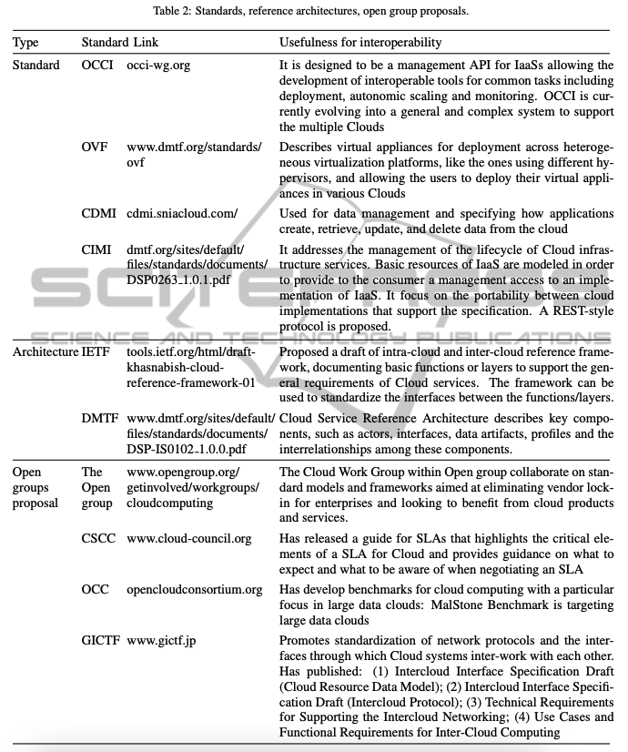

# Multi-cloud Challenges

## Table of Contents

- [Multi-cloud Challenges](#multi-cloud-challenges)
  - [Table of Contents](#table-of-contents)
  - [Interoperability](#interoperability)
    - [Problems](#problems)
    - [On the Interoperability in Multiple Clouds](#on-the-interoperability-in-multiple-clouds)
      - [Interoperability Requirements](#interoperability-requirements)
      - [Example](#example)

---

When talking about multi-cloud environments:

- **Interoperability** means the ability of two distinct cloud environments to talk to each other - to exchange information in a way that both can understand.
- **Cloud portability** is the ability to move applications and data from one cloud environment to another with minimal disruption.

## Interoperability

At its core, interoperability **requires shared processes, APIs, containers and data model**s across the multi-cloud environment to enable communication between application components.

### Problems

1. Sheer variety of data integration, cloud APIs and interfaces, with no standards in place.
2. Moving data and configurations between SaaS applications primary portability concern today

### [On the Interoperability in Multiple Clouds]

**Figure 1** is suggesting the three dimensions of the interoperability problem. Two are technical and encountered as pointed earlier, at run-time in Federated Clouds and at design time in Multi-Cloud. The third dimension is non-technical, more human oriented, as being related to policy, i.e. establishing agreements and contracts between providers, as well as standards elaborations and promotion.

#### Interoperability Requirements

For the run-time dimension, at the infrastructure levels (last two in the table and image), several partial solutions exists to migrate virtual machines, virtual storage or services. Despite the presence of standard OVF format, the VMs are not yet ready for interoperability. For example, Amazon is one of the few Cloud providers who are allowing to export VMs; however, their related resources (e.g. network, storage) cannot be exported too. In general, VMs cannot be transferred from one hypervisor to another. VMs can be converted today with tools like qemu-image, but this requires to stop the VM and to apply the adaptation off-line.

It should be also mentioned that the diversity of the APIs is natural, as each providers intends to offer something new or unique compared with other offers, in order to attract customers. The interoperability issue is therefore an issue for the management and governance levels where automation should be achieved as much as possible. The mix-in of services from different providers can be a strong argument in using such entry level instead a direct connection to only one provider. Therefore the management and service automation levels in multiple Clouds are the hot-spots of the development activities in the last two years (commercial solutions like RightScale, enStratus or Kaavo have emerge that are able to deploy applications in various Clouds, but not yet migrate the running ones).

For the design time dimension, several prototypes are available, from frameworks like SLA@SOI or the more recent (Di Modica et al, 2012), as well as APIs like jclouds, libcloud or OpenStack (a more complete list at (Lee, 2009)), or emerging standards like CloudML, but there is no wide acceptance of one or another proposal. Nor a Cloud specific programming model has emerge, despite the high-potential of the concept of e-infrastructure programming (Petcu et al, 2012b).

**Figure 2** is proposing a split of the requirements in different categories (based on the initial classification proposed in (Khattak et al, 2010). The top level is associated with the policy dimension; the next one with the design; the last three with the run-time. The most complex level is the one related to application and services, that is covering both design and run-time.

While industry bodies are developing common cloud standards, Cloud Service Providers (CSPs) are developing adapters, APIs and containers to facilitate interoperability across platforms.

**Tables 2 and 3** are pointing to some of the standards respectively standard initiatives that are relevant for interoperability.

#### Example

mOSAIC is providing an open-source and deployable Platform-as-a-Service that is supporting multi-Cloud scenario of re-deployment. The initial cycle of its development was supported through a collaborative and multi-national project, funded by the European Commission and ended in Spring 2013.

Table 4 indicates the main components of the latest stack of mOSAIC’s software:

Drivers and vendor agents are currently available for various Public Cloud providers (Amazon, Flexiant, CloudSigma, GoGrid, OnApp, NIIFI) as well as for Private Cloud support technologies (Eucalyptus, OpenNebula, VMware, DeltaCloud, OpenStack, CloudStack).

– **Red components:** for the design phase: API libraries (for Java, Python and Erlang) with examples; application tools including plug-ins for Eclipse, templates and workflows; semantic support for developing applications, using domain specific and Cloud ontologies; a service-level agreement framework based on concepts introduced by SLA@SOI;

– **Green components:** for the deployment phase: the brokerage system including the Cloud Agency that assists in the selection of the Cloud provider according to the application needs specified in a particular descriptor and generating the service level agreement, as well as vendor agents;

– **Blue components:** for the runtime phase: support for a Personal Cloud (on a desktop using the Portable Testbed Cluster), for provider resource allocation based on existing credentials, the minimal kernel of the platform (mOS) to run remotely on providers’ virtual machines, a naming service that offers an application virtual domain, and the execution engine that allows the control of the deployed applications; customized versions of open source Cloud technologies (for message queues, key value stores, distributed file systems) are available to be deployed (COTS) with corresponding drivers; special web-interfaces and console interfaces are allowing the control of the application life-cycle at the level of their components; benchmark sets are supporting the testing of applications and infrastructure services;

– **Purple components:** the proof-of-the-concept applications.

Secure multi-cloud network architectures take into account:

- **The cloud edge**, which connects the enterprise WAN to the cloud across regions and between multiple public clouds. This may consist of various transit gateways and native cloud interconnects.
- **The WAN edge**, which connects on-prem workloads and end users to external networks through private WAN and/or internet. SD-WAN devices deployed near a branch office or remote working hub are examples of the WAN edge.
- **Transport connectivity** (MPLS, internet, LTE, 4G, 5G) linking the WAN edge and cloud edge become part of SD-WAN fabric enabling improved application performance and cost-efficiency.
- **Software-defined network and security services** such as FWaaS, ZTNA, CASB, and others.
