# OS Migration
Migration between OpenStack clouds using [OS Migrate](https://os-migrate.github.io/os-migrate/index.html). 

**OS Migrate** is an open source toolbox for parallel cloud migration between OpenStack clouds. OS Migrate provides a framework for exporting and importing resources between two clouds.

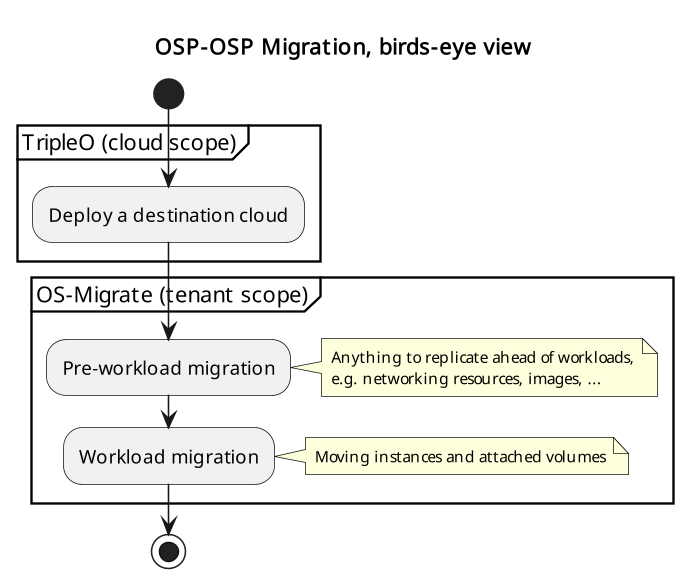

The migration is generally performed in this sequence:
- **Prerequisites**: prepare authentication info, parameter files,
- **Pre-workload migration** copies applicable resources into the destination cloud (e.g. networks, security groups, images) while workloads keep running in the source cloud,
- **Workload migration** stops usage of applicable resources in the source cloud and moves them into the destination cloud (VMs, volumes).
## Installation
Using virtualenv:
``` bash
python3 -m venv $HOME/os_migrate_venv
source $HOME/os_migrate_venv/bin/activate
python3 -m pip install --upgrade 'openstacksdk>=0.36,<0.99'
python3 -m pip install --upgrade 'ansible-core'
```

Create directory:
``` bash
sudo mkdir /home/migrator
```

To install latest release:
``` bash
ansible-galaxy collection install os_migrate.os_migrate -p /home/migrator
```

To install a particular release:
``` bash
ansible-galaxy collection install os_migrate.os_migrate:<VERSION> -p /home/migrator
```

## Prerequisites
### Parameter file
Create an `os-migrate-vars.yml` file with Ansible variables:
``` yml
os_migrate_src_auth:
  auth_url: http://116.103.226.54:5000/v3
  password: password-src
  project_domain_name: Default
  project_name: admin
  user_domain_name: Default
  username: admin
os_migrate_src_region_name: regionOne
os_migrate_dst_auth:
  auth_url: http://116.103.227.30:5000/v3
  password: password-dst
  project_domain_name: Default
  project_name: admin
  user_domain_name: Default
  username: admin
os_migrate_dst_region_name: regionOne

os_migrate_data_dir: /home/migrator/os-migrate-data
```

The file contains:
- The source and destination tenant credentials
	- The OpenStack source IP address: **116.103.226.54**
	- The OpenStack destination IP address: **116.103.227.30**
- A directory on the migrator host (typically localhost)
- A directory where the exported data will be saved (`os_migrate_dst_region_name`).

### Shortcuts
``` bash
export OSM_DIR=/home/test-migrator/ansible_collections/os_migrate/os_migrate
export OSM_CMD="ansible-playbook -v -i $OSM_DIR/localhost_inventory.yml -e @os-migrate-vars.yml"
```

## Pre-workload migration
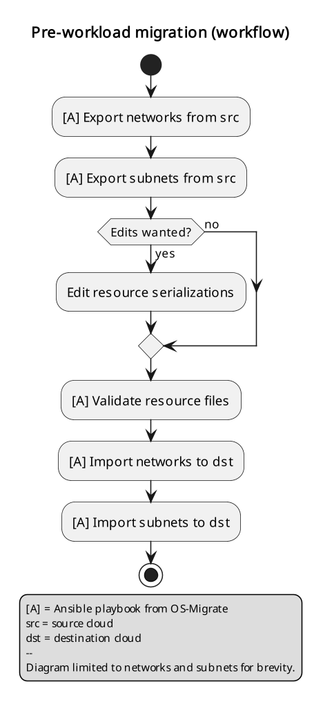
### Export and import
#### Network
Network from OpenStack source (***116.103.226.54***):

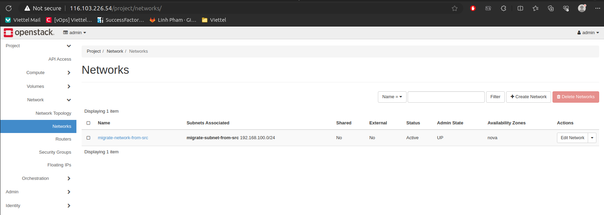

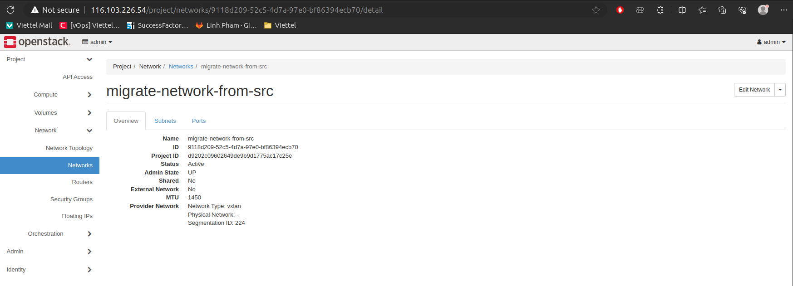

To export the networks:
``` bash
$OSM_CMD $OSM_DIR/playbooks/export_networks.yml
```

**Result**
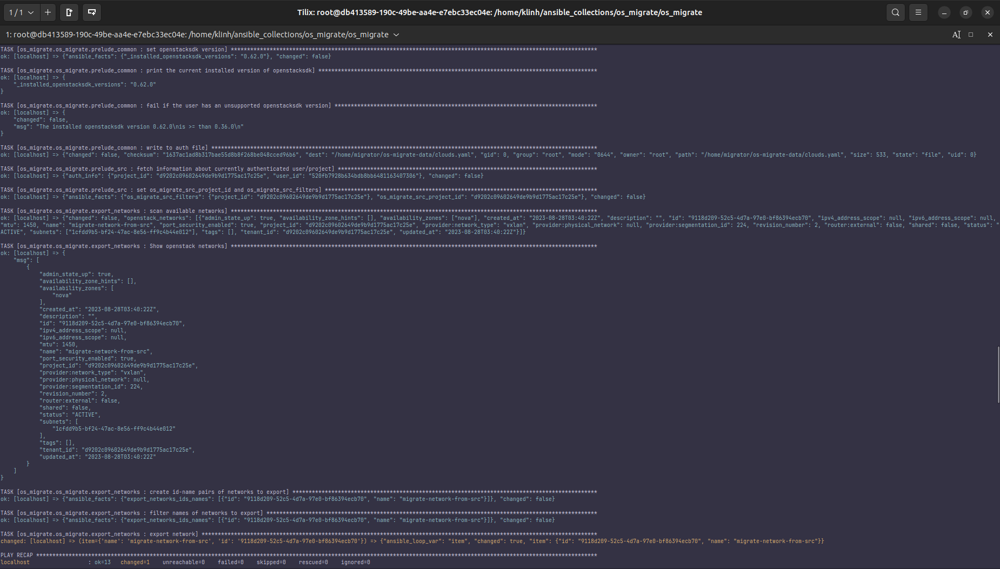

This will create `networks.yml` file in the data directory:
``` yml
os_migrate_version: 0.15.1
resources:
- _info:
    availability_zones:
    - nova
    created_at: '2023-08-28T03:40:22Z'
    id: 9118d209-52c5-4d7a-97e0-bf86394ecb70
    project_id: d9202c09602649de9b9d1775ac17c25e
    qos_policy_id: null
    revision_number: 2
    status: ACTIVE
    subnet_ids:
    - 1cfdd9b5-bf24-47ac-8e56-ff9c4b44e012
    updated_at: '2023-08-28T03:40:22Z'
  _migration_params: {}
  params:
    availability_zone_hints: []
    description: ''
    dns_domain: null
    is_admin_state_up: true
    is_default: null
    is_port_security_enabled: true
    is_router_external: false
    is_shared: false
    is_vlan_transparent: null
    mtu: 1450
    name: migrate-network-from-src
    provider_network_type: vxlan
    provider_physical_network: null
    provider_segmentation_id: 224
    qos_policy_ref: null
    segments: null
    tags: []
  type: openstack.network.Network
```

The file is editable as needed and then run the “***import_networks***” playbook to import the networks from this file into the destination cloud:

``` bash
$OSM_CMD $OSM_DIR/playbooks/import_networks.yml
```

**Result**
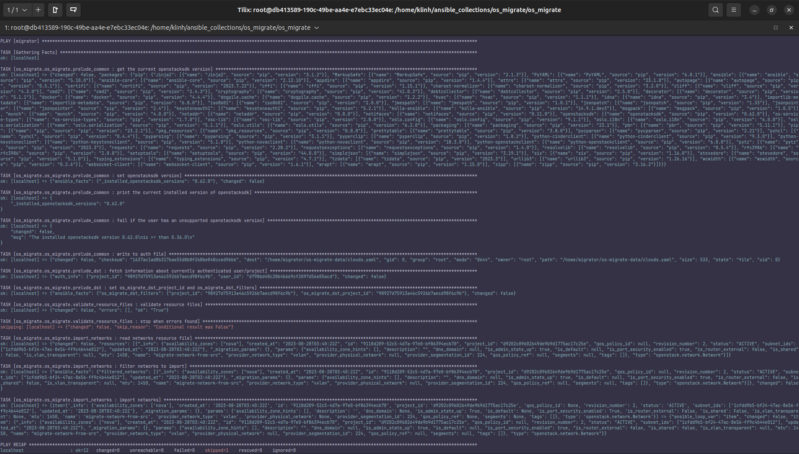

After importing network from Openstack source, we can see that in OpenStack destination (***116.103.227.30***):
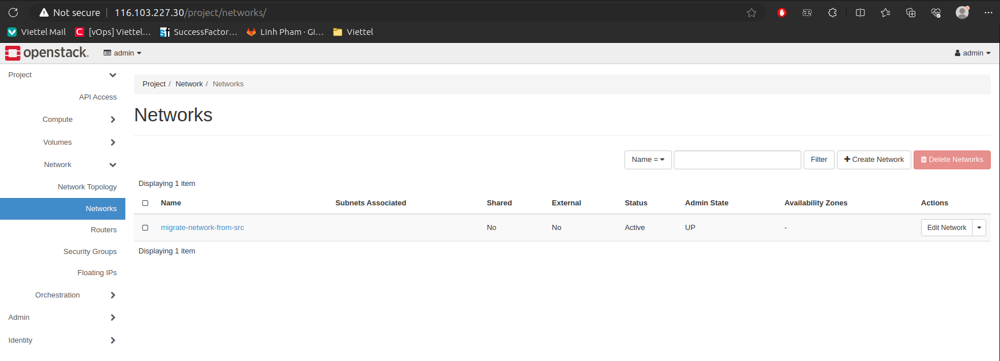


#### Subnet
Subnet from OpenStack source:


To export the subnets:
``` bash
$OSM_CMD $OSM_DIR/playbooks/export_subnets.yml
```

**Result**
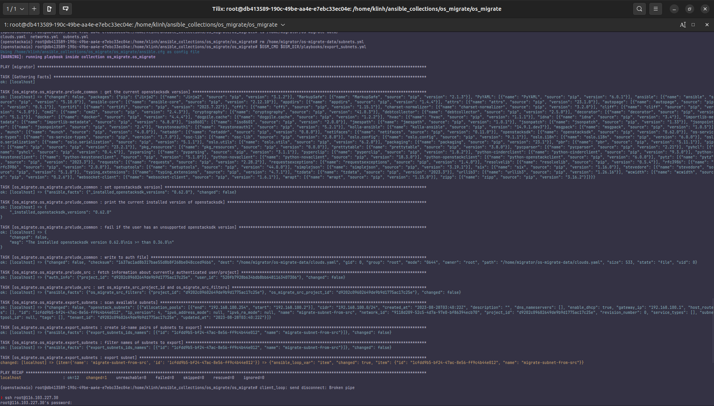

This will create `subnets.yml` file in the data directory:
``` yml
os_migrate_version: 0.15.1
resources:
- _info:
    created_at: '2023-08-28T03:40:22Z'
    id: 1cfdd9b5-bf24-47ac-8e56-ff9c4b44e012
    network_id: 9118d209-52c5-4d7a-97e0-bf86394ecb70
    prefix_length: null
    project_id: d9202c09602649de9b9d1775ac17c25e
    revision_number: 0
    segment_id: null
    subnet_pool_id: null
    updated_at: '2023-08-28T03:40:22Z'
  _migration_params: {}
  params:
    allocation_pools:
    - end: 192.168.100.254
      start: 192.168.100.2
    cidr: 192.168.100.0/24
    description: ''
    dns_nameservers: []
    gateway_ip: 192.168.100.1
    host_routes: []
    ip_version: 4
    ipv6_address_mode: null
    ipv6_ra_mode: null
    is_dhcp_enabled: true
    name: migrate-subnet-from-src
    network_ref:
      domain_name: '%auth%'
      name: migrate-network-from-src
      project_name: '%auth%'
    segment_ref: null
    service_types: []
    subnet_pool_ref: null
    tags: []
    use_default_subnet_pool: null
  type: openstack.subnet.Subnet
  ```

Similarly, the file may be edited then run the “**import_subnets**” playbook to import the subnets into the destination cloud.

``` bash
$OSM_CMD $OSM_DIR/playbooks/import_subnets.yml
```

**Result**
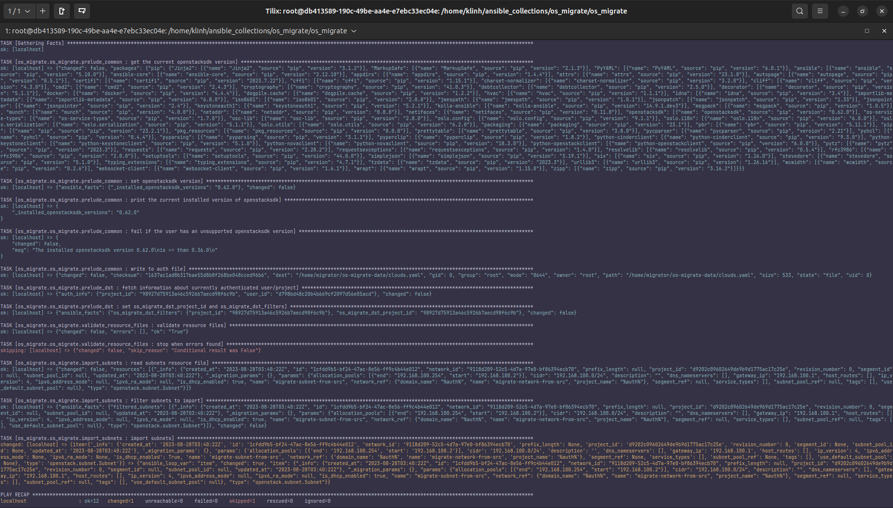

In OpenStack destination:
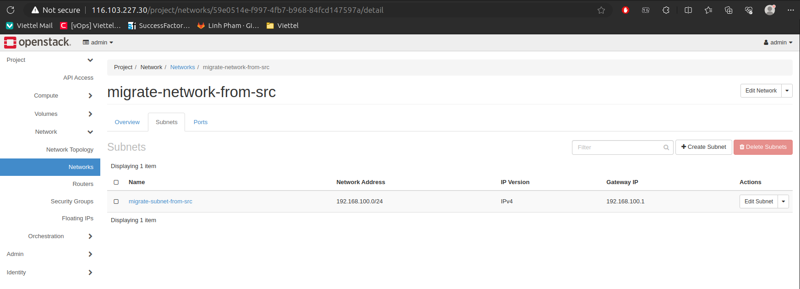

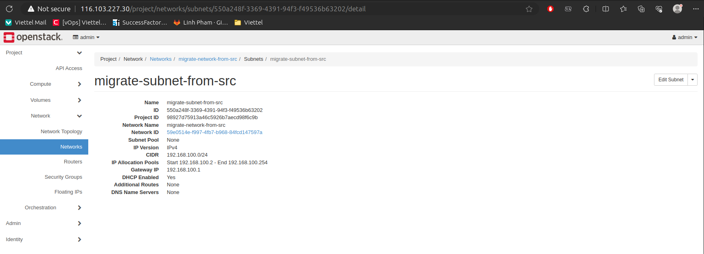

This process can be repeated for other resources like security groups, security group rules, routers, router interfaces, images and keypairs.
## Workload migration
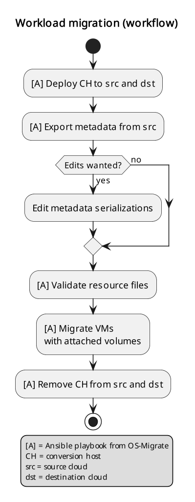

The process involves the deployment of a "**conversion host**" on source and destination clouds. 

A **conversion host** is an OpenStack server which will be used to transfer binary volume data from the source to the destination cloud. The conversion hosts are expected to be created from CentOS 9 or RHEL 8 cloud images.

The following diagram helps explain the need for a conversion host VM:

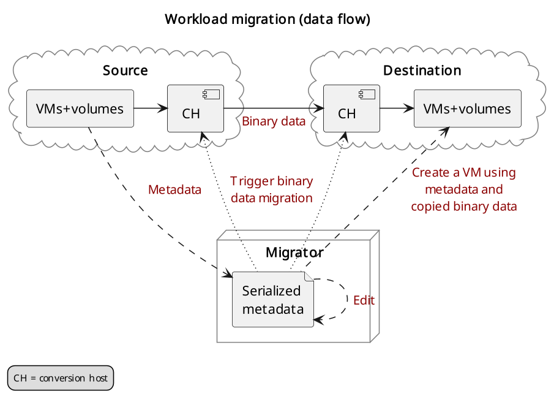

This shows that volumes on the source and destination clouds are removed from their original VMs and attached to their respective conversion hosts, and then transferred over the network from the source conversion host to the destination. The tooling inside the conversion host migrates one server by automating these actions on the source and destination clouds:

**Source Cloud:** </br>
- Detach volumes from the target server to migrate
- Attach the volumes to the source conversion host
- Export the volumes as block devices and wait for destination conversion host to connect

**Destination Cloud:** </br>
- Create new volumes on the destination conversion host, one for each source volume
- Attach the new volumes to the destination conversion host
- Connect to the block devices exported by source conversion host, and copy the data to the new attached volumes
- Detach the volumes from the destination conversion host
- Create a new server using the new volumes
### Preparation
Put additional parameters into `os-migrate-vars.yml`:
``` bash
os_migrate_conversion_external_network_name: public
os_migrate_conversion_flavor_name: m1.large
```

These define the flavor and external network we want to use for our conversion hosts.

By default the migration will use an image named `os_migrate_conv` for conversion hosts. Make sure this image exists in Glance on both clouds. Currently it should be a [CentOS 9 Cloud Image](https://cloud.centos.org/centos/9-stream/x86_64/images/CentOS-Stream-GenericCloud-9-20220914.0.x86_64.qcow2) or [RHEL 8 KVM Guest Image](https://access.redhat.com/downloads/content/479/ver=/rhel---8/8.3/x86_64/product-software).

When using RHEL as conversion host, make sure to set the necessary [RHEL variables](https://os-migrate.github.io/os-migrate/user/variables-guide.html#conversion-host-rhel-variables).


## References
- [OS Migrate Documents](https://os-migrate.github.io/os-migrate/index.html)
- [OS Migrate Github](https://github.com/os-migrate/os-migrate)